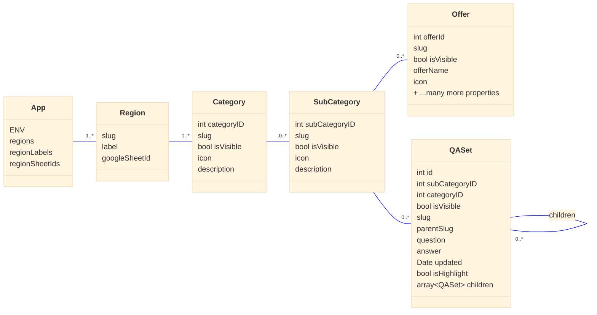
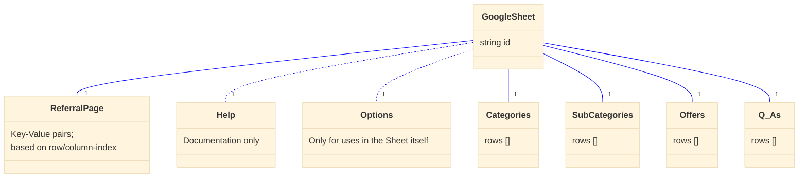

# Helpful Information

> A web-app _People Affected_ can use to lookup useful organizations and information.

---

## Status

Latest releases and notable changes are in the [CHANGELOG](CHANGELOG.md).

- [](https://github.com/rodekruis/helpful-information/actions/workflows/tests.yml)
- NL:
  [](https://github.com/rodekruis/helpful-information/actions/workflows/deploy-staging.yml)
  [](https://github.com/rodekruis/helpful-information/actions/workflows/deploy-production.yml)
- UKR:
  [](https://github.com/rodekruis/helpful-information/actions/workflows/deploy-staging-ukr.yml)
  [](https://github.com/rodekruis/helpful-information/actions/workflows/deploy-production-ukr.yml)

---

## How it works

The Helpful Information App (HIA) is a web-app that can show a list of 1 or more "_regions_", each of which is a separate dataset of structured content. This consists of "_Offers_", sorted in "_Categories_" and (optional) "_Sub-Categories_".

The web-app is a pre-build, static web-app that lists links to "regions", which are all separate data-sources contained in Google Sheets 'files'.

The different sheets within these 'files' each have a different data-model. So that their content can be used to display in the web-app.

The contents of these sheets is loaded at runtime by the visitor's browser from the "Google Sheets API".

## How to use

Once the web-app is configured (See [Configuration](#configuration)) and deployed (See [Deployment](#deployment)) its content can be managed via the [Google Sheets interface](https://docs.google.com/spreadsheets).

### Security

> ⚠️ **All content** of the web-app can be controlled by the contents of the Google Sheet in use.

So take appropriate precautions regarding file-ownership and "edit"-permissions of these files and the related Google Accounts.

- Limit the amount of users/Google Accounts that have "edit"-permissions to the 'least possible'
- Don't share the credentials/passwords of these accounts with multiple people
- Use a strong password on these Google Accounts
- Use all possible extra security-features on these Google Accounts, like 2-factor-authentication etc.

### Working with Google Sheets 'files'

> ⚠️ **Everything** is visible on the website on **every** 'save' (so, immediately, most of the times).

- Don't change the _name_ of any sheet.
- Don't change the _`#tag`s_ in the columns-headers in any sheet, the name/label/heading can be changed/translated.
- Don't use formatting (bold/italic/underline/fonts/colors); It will not be used.
- Don't use the "insert link"-feature.  
  The plain text in a cell should be the full URL.

Optional:

- All header-rows can be reordered, as long as their `#tag`s remain.
- You can use the toggle in the "_Visible?_"-column to prepare a 'draft' of a row and finally 'publish' by setting it to "_Show_".
- You can use background-colors to mark/highlight any changes or 'flag issues'; These styles will not be used in the web-app.

---

## Getting Started

- Install environment requirements:

  Install the Node.js version specified in the [`.node-version`](.node-version)-file.  
  To prevent conflicts it is recommended to use a 'version manager'.

  - [`fnm`](https://github.com/Schniz/fnm#readme) (for Windows/macOS/Linux)
    After installing, run in this directory:

        fnm use

- Install dependencies (from this directory):

      npm install

- To finish you local set-up, run (required only once):

      npm run setup

- Start in development-mode:

      npm start

- Start in production-mode:

      npm run start:production

## Configuration

Some specific information needs to be configured before use:

- For use in development:  
  Set these different properties in the [`environment.ts`](./src/environments/environment.ts)-file.

- For use in production:  
  These values need to be set in the [`.env`](.env.example)-file. Or as ENV-variables via other means.

- For deployments:  
  The ENV-variables defined in the [`.env.example`](.env.example)-file need to be defined in the build-environment according to the specific deployment-tool/service.  
  See for example the [GitHub Action workflow (production)](.github/workflows/deploy-production.yml).

### Using the Google Sheets API

- To be able to use the [Google Sheets API](https://developers.google.com/sheets/api) a 'credential' in the shape of an API-key is required.
- To get an API-key, follow the instructions:  
  <https://developers.google.com/workspace/guides/create-credentials#api-key>
- Configure the restrictions on the API-key following:  
  <https://cloud.google.com/docs/authentication/api-keys#adding_http_restrictions>  
  Make sure to include _only_ the domains/referrers that will be used.  
  Also include `http://localhost:4200/*` and `http://localhost:8080/*` to be able to load data during local development. (Or even better; create a separate API-key for that)

## Local development

As part of the installed dev-dependencies, we use [Prettier](https://prettier.io/) to format our code and [husky](https://typicode.github.io/husky/#/?id=faq) to automate that when using Git.

### Local API

To use a local API, without the need for any Google account/credentials.

1. Update the local [`environment.ts`](src/environments/environment.ts)-file with:

   ```ts
       regions: 'test-local-1',
       regionsLabels: 'Test Local 1',
       regionsSheetIds: 'test-sheet-id-1',

       google_sheets_api_key: '<can be anything, will be ignored>';
       google_sheets_api_url: 'http://localhost:3001',
   ```

2. Run (in a separate process/terminal):

   npm run serve:local-data

3. Adjust the JSON-files in the [`data`](data/)-directory to try out different content.

### Testing

Automated tests are configured and can be run (once) with:

    npm test

During development, an automated watch-process can be run with:

    npm run test:watch

### Recommended tools

- [Workspace recommendations for VS Code](.vscode/extensions.json)
  When you use [VS Code](https://code.visualstudio.com/) and go to: "_Extensions_" and use the filter: "_Recommended_";
  A list should be shown and each extension can be installed individually.

### Libraries/frameworks in use

- [Ionic v6](https://ionicframework.com/docs/v6/)
  > ⚠️ The [`Ionicons`](https://ionic.io/ionicons) icon-set is NOT included in the final build, so cannot be used 'by default'. Icons can be added manually.
- [Angular v15](https://v15.angular.io/docs/)

### Updating dependencies

Most (development-)dependencies in this repository are monitored by the GitHub [Dependabot](https://docs.github.com/en/code-security/dependabot/dependabot-version-updates/about-dependabot-version-updates) service, too keep them up-to-date.  
Unfortunately most individual dependencies are 'linked' to related dependencies that need to stay 'in sync'.

To update all Angular and ESLint related dependencies, run:

    npm run upgrade:angular

---

## Data Model

Based on the date fetched from the Google Sheets, an internal data-structure is build. This is used to render the interface.

The following are _illustrations_ only, to help get an overview, it might not be up-to-date with the actual code.

### Data Model (internal)

> The code below can be easily edited/previewed using the [Mermaid.live](https://mermaid.live) editor.



### Data Model (external)

> The code below can be easily edited/previewed using the [Mermaid.live](https://mermaid.live) editor.



---

## Features

### Build level configuration

See the options in the [`.env.example`](.env.example)-file.

### Sheet level configuration

See the options in the "Referral Page"-sheet

### (Sub-)Category features

Each (Sub-)Category:

- can have a name/description/icon.
- can be hidden by setting the "**Visible?**"-column to `Hide`.

### Offer features

Each Offer

- needs to have a `Category ID` and a `Sub-Category ID` set.
- can be hidden by setting the "**Visible?**"-column to `Hide`.

### Q&A features

Each Q&A-set

- needs to have a `Category ID` and a `Sub-Category ID` set.
- can be hidden by setting the "**Visible?**"-column to `Hide`.
- can be shown as a Sub-Question by setting the `Parent`-column to the Slug of another Question.
- can have a "(last) updated"-date set, to indicate its 'freshness'

#### Highlighted-overview ("Recent changes")

- Each Q&A-set can be shown in the Highlighted-overview by setting the "**Highlighted?**"-column to `Yes`.
- All these sets will be shown with their Category/Sub-Category-context (with links).
- Their "(last) updated"-date is shown prominently, for easy scanning/spotting "what's new?"
- The sets with a "(last) updated"-date will be shown with the "most recent"-date first, those _without_ a date are shown after, in the order they appear in the sheet.

#### Search

Using the search-input Q&A-sets can be filtered to match 1 or more keywords to the `Question` OR the `Answer` values of a Q&A-set.

- Keywords are case-insensitive, so `Help` will match `help`, `HELP` or `HeLp`
- Some special characters will be ignored, like `+`, `*`, `[`, `]`, `(`, `)`, etc. Periods (`.`) can be included in keywords to match URLs
- Each keyword needs to be separated by spaces (not `,` or `;`, etc.)
- To include spaces in a keyword, surround with: `"` (double quotes)  
  For example: `help "Red Cross"` will match `help` or `Red Cross`

---

## Deployment

The web-app can be deployed as a static single-page-app or PWA.

- Make sure the `.env`-configuration is prepared. See: [`.env.example`](.env.example)
- To generate a directory(`www`) with all HTML, JS, JSON and SVG assets, run:

      npm run build:production

- This directory can be deployed to any hosting-solution (supporting HTTPS), using [the recommended server configuration](https://v13.angular.io/guide/deployment#server-configuration).

### Using Azure Static Web Apps

To deploy the web-app using [Azure Static Web App service](https://azure.microsoft.com/en-us/services/app-service/static/):

- A GitHub-Actions workflow needs to be defined,  
  See: [`.github/workflows/deploy-production.yml`](.github/workflows/deploy-production.yml)
- The configuration of URLs, Headers for the web-app is defined,  
  in: [`staticwebapp.config.json`](staticwebapp.config.json)  
  See documentation about the format in [this example configuration file](https://docs.microsoft.com/en-us/azure/static-web-apps/configuration#example-configuration-file)

### Using static file hosting (i.e. Surge.sh, GitHub/GitLab Pages or similar)

To deploy the web-app using or a static-files web-host, see options at: <https://www.jamstackdeploy.com/>

Configure and build a 'production'-build of the web-app following the steps [defined at "Deployment"](#deployment).

Follow one of these ['guides' from Surge](https://surge.sh/help/#:~:text=Guides)

---

## License

Released under the Apache 2.0 License. See [LICENSE](./LICENSE).
